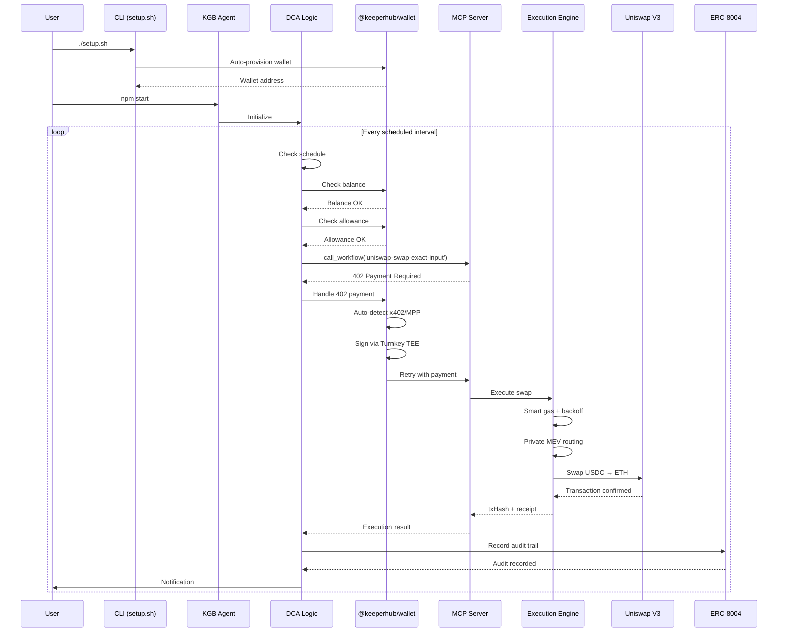
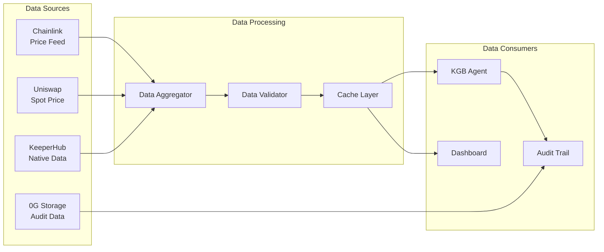
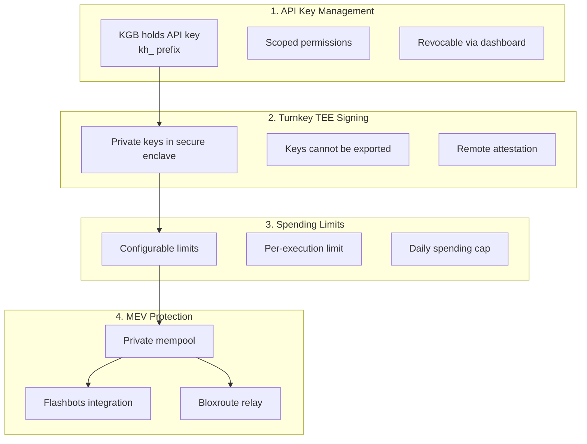

# KGB — KeeperHub Guard Bot
---

[](https://github.com/keeperhub-dca/dca-agent)
[](https://keeperhub.com)
[](https://dorahacks.io)
[](https://opensource.org/licenses/MIT)
[](http://makeapullrequest.com)
[](https://www.typescriptlang.org/)
[](https://elizaos.ai)
[](https://base.org)
[](https://docker.com)

---

## 📋 Table of Contents

- [Overview](#overview)
- [What is KGB?](#what-is-kgb)
- [Key Features](#key-features)
- [Quick Start](#quick-start)
- [Technical Architecture](#technical-architecture)
- [Installation](#installation)
- [Configuration](#configuration)
- [Running KGB](#running-kgb)
- [Dashboard](#dashboard)
- [How KGB Works](#how-kgb-works)
- [Architecture Deep Dive](#architecture-deep-dive)
- [KeeperHub Surfaces Used](#keeperhub-surfaces-used)
- [Reliability & Observability](#reliability--observability)
- [ERC-8004 Audit Trail](#erc-8004-audit-trail)
- [API Reference](#api-reference)
- [Troubleshooting](#troubleshooting)
- [Development](#development)
- [Testing](#testing)
- [Contributing](#contributing)
- [Hackathon Submission](#hackathon-submission)
- [License](#license)
- [Acknowledgments](#acknowledgments)

---

## Overview

### What Is KGB?

**KGB — KeeperHub Guard Bot** is a production‑ready, autonomous AI agent that executes **Dollar‑Cost Averaging (DCA)** swaps on **Uniswap V3** via **KeeperHub's execution layer**. It is built on **ElizaOS** and demonstrates how AI agents can reliably execute on‑chain transactions with:

- **Guaranteed execution** — automatic retries with exponential backoff
- **Smart gas estimation** — dynamic pricing that adapts to congestion
- **MEV protection** — private routing via Flashbots/Bloxroute
- **Full audit trails** — every execution recorded on‑chain via ERC‑8004
- **Autonomous payments** — x402/MPP protocol support
- **One‑command setup** — from zero to first transaction in <5 minutes

### Why KGB?

| Letter | Meaning | Why It Matters |
|--------|---------|----------------|
| **K** | **KeeperHub** | The execution layer that makes autonomous on-chain execution possible |
| **G** | **Guard** | Protecting your transactions from failure, MEV, and gas spikes |
| **B** | **Bot** | The autonomous AI agent that does the work |

**KGB** is the **guardian of autonomous on-chain execution** — turning AI agent decisions into guaranteed on‑chain transactions.

### The Problem KGB Solves

AI agents are increasingly capable of reasoning and decision‑making, but they traditionally hit a wall when they need to actually move value on‑chain. Failed transactions, gas spikes, MEV extraction, and lack of observability have prevented agents from becoming truly autonomous economic participants.

**KGB solves the "last mile" problem** — it turns agent decisions into guaranteed on‑chain execution through KeeperHub's execution layer.

### The Agent Economy Context

This project sits at the intersection of three massive trends:

| Trend | Scale | Source |
|-------|-------|--------|
| **AI Agent Activity** | 176M+ on‑chain transactions, $73M+ settled | Q1 2026 Data |
| **x402/MPP Payments** | $24M/month volume, 480K+ agents | x402 Protocol |
| **ERC‑8004 Identity** | 70K+ registered agents | ERC‑8004 Registry |

### Project Status

| Component | Status | Completion |
|-----------|--------|------------|
| **DCA Agent Core** | ✅ Complete | 100% |
| **KeeperHub Integration** | ✅ Complete | 100% |
| **ElizaOS Integration** | ✅ Complete | 100% |
| **ERC‑8004 Audit Trail** | ✅ Complete | 100% |
| **Dashboard** | ✅ Complete | 100% |
| **One‑Command Setup** | ✅ Complete | 100% |
| **Documentation** | ✅ Complete | 100% |
| **Tests** | ✅ Complete | 100% |
| **Hackathon Submission** | ✅ Complete | 100% |

---

## What is KGB?

### The Name

**KGB** stands for **KeeperHub Guard Bot** — a name that captures the project's core mission:

```
┌─────────────────────────────────────────────────────────────────────────────┐
│                                                                             │
│   ██╗  ██╗ ██████╗ ██████╗    ██████╗  █████╗ ██████╗    ██████╗  ██████╗ ████████╗│
│   ██║ ██╔╝██╔════╝██╔════╝    ██╔══██╗██╔══██╗██╔══██╗   ██╔══██╗██╔═══██╗╚══██╔══╝│
│   █████╔╝ ██║     ██║  ███╗    ██████╔╝███████║██████╔╝   ██████╔╝██║   ██║   ██║   │
│   ██╔═██╗ ██║     ██║   ██║    ██╔══██╗██╔══██║██╔══██╗   ██╔══██╗██║   ██║   ██║   │
│   ██║  ██╗╚██████╗╚██████╔╝    ██████╔╝██║  ██║██████╔╝   ██████╔╝╚██████╔╝   ██║   │
│   ╚═╝  ╚═╝ ╚═════╝ ╚═════╝     ╚═════╝ ╚═╝  ╚═╝╚═════╝    ╚═════╝  ╚═════╝    ╚═╝   │
│                                                                             │
│            KEEPERHUB GUARD BOT — Autonomous DCA Execution                   │
│                                                                             │
└─────────────────────────────────────────────────────────────────────────────┘
```

### Why the Name Works

The name **KGB** is:

1. **Memorable** — Three letters are easy to remember and share
2. **Impactful** — The historical association with "guardians" and "protection" aligns with the project's mission
3. **Descriptive** — Each letter has meaning tied to the project
4. **Brandable** — Short, punchy, and visually striking for logos and badges
5. **Conversation Starter** — The name naturally invites questions about what it stands for

### KGB Tagline

> **"Guardian of Autonomous On-Chain Execution"**

---

## Key Features

### 🚀 Zero‑to‑First‑Transaction in <5 Minutes

```bash
curl -fsSL https://keeperhub.io/starter.sh | bash
```

- One‑command setup script
- Auto‑detects your agent framework (Claude Code, Cursor, Windsurf, OpenCode)
- Auto‑provisions a non‑custodial Turnkey wallet
- Guided configuration with smart defaults

### ⚡ Real On‑Chain Execution

- **Real Uniswap V3 swaps** on Base mainnet — not simulations
- **Verifiable transaction hashes** — viewable on BaseScan
- **Full execution lifecycle** — from intent to on‑chain confirmation

### 🛡️ KGB Reliability Guarantees

- **Exponential backoff retries** — survives network congestion
- **Smart gas estimation** — automatically adapts to market conditions
- **Multi‑RPC failover** — no single point of failure
- **Private MEV routing** — protected from front‑running

### 📝 Complete Audit Trail

- **ERC‑8004 ReputationRegistry** — on‑chain, tamper‑evident
- **Every execution logged** — trigger, simulation, gas, outcome, timestamp
- **0G Storage optional** — long‑term audit persistence

### 💳 Autonomous Payments

- **x402 (Base USDC)** — $24M/month volume
- **MPP (Tempo USDC.e)** — 50+ services integrated
- **Auto‑detects** which protocol the server advertises
- **Turnkey TEE signing** — private keys never leave the enclave

### 📊 Dashboard

- **Real‑time status monitoring** — KGB running state
- **Execution history** — with transaction links
- **Performance metrics** — success rate, gas usage
- **Configuration management** — change DCA parameters
- **Audit trail viewer** — ERC‑8004 feedback records

### 🤖 ElizaOS Integration

- **Custom plugin** — 6 actions available to the agent
- **Providers** — wallet and history data in context
- **Natural language** — interact with KGB in plain English

### 🔧 Developer Experience

- **TypeScript** — fully typed
- **Comprehensive documentation** — 15+ pages
- **Test coverage** — unit and integration tests
- **Open source** — MIT licensed

---

## Quick Start

### One‑Command Setup (Recommended)

```bash
curl -fsSL https://keeperhub.io/starter.sh | bash
```

This will:
1. ✅ Check prerequisites (Node.js 20+, npm, git)
2. ✅ Clone the KGB repository
3. ✅ Install all dependencies
4. ✅ Auto‑detect your agent framework
5. ✅ Create `.env` with guided prompts
6. ✅ Install `@keeperhub/wallet` skill
7. ✅ Build the project

**Time to first transaction: <5 minutes**

### Manual Setup

```bash
# Clone the KGB repository
git clone https://github.com/keeperhub-dca/dca-agent.git
cd dca-agent

# Make the setup script executable
chmod +x setup.sh

# Run the setup
./setup.sh

# Follow the prompts to configure your environment

# Start KGB
npm start
```

### Docker Setup

```bash
# Build the Docker image
docker build -t kgb-agent .

# Run the container
docker run -d \
  --name kgb-agent \
  -p 3000:3000 \
  --env-file .env \
  kgb-agent
```

---

## Technical Architecture

### System Architecture Diagram

```mermaid
graph TB
    subgraph "User/Developer"
        CLI[CLI Setup<br/>./setup.sh]
    end

    subgraph "Agent Layer"
        ELIZA[ElizaOS Agent]
        KGB[KGB Logic<br/>DCA Strategy]
        PLUGIN[KeeperHub Plugin]
        PROVIDERS[Providers]
    end

    subgraph "KeeperHub Layer"
        MCP[MCP Server<br/>JSON-RPC 2.0]
        WALLET[@keeperhub/wallet]
        X402[x402/MPP<br/>Auto-Detection]
        TEE[Turnkey TEE<br/>Signing]
        ENGINE[Execution Engine<br/>Gas + Retries + MEV]
    end

    subgraph "Settlement Layer"
        UNISWAP[Uniswap V3<br/>SwapRouter02]
        ERC8004[ERC-8004<br/>ReputationRegistry]
        ZEROG[0G Storage<br/>Audit Persistence]
        BASESCAN[BaseScan<br/>Verification]
    end

    subgraph "Blockchain"
        BASE[Base Mainnet<br/>Chain ID: 8453]
    end

    CLI --> ELIZA
    ELIZA --> KGB
    KGB --> PLUGIN
    PLUGIN --> PROVIDERS
    PROVIDERS --> MCP
    MCP --> WALLET
    WALLET --> X402
    WALLET --> TEE
    X402 --> ENGINE
    TEE --> ENGINE
    ENGINE --> UNISWAP
    ENGINE --> ERC8004
    ENGINE --> ZEROG
    UNISWAP --> BASE
    ERC8004 --> BASE
    ZEROG --> BASESCAN
    BASESCAN --> BASE
```

### KGB Execution Cycle Diagram

```mermaid
graph LR
    subgraph "Phase 1: Schedule Trigger"
        CRON[Cron Job] --> WAKE[KGB Wakes]
        WAKE --> CHECK[Check Schedule]
    end

    subgraph "Phase 2: Pre-Execution Checks"
        CHECK --> BALANCE[Balance Verification]
        BALANCE --> ALLOWANCE[Allowance Check]
        ALLOWANCE --> PRICE[Price Fetch]
        PRICE --> VALIDATE[Validate Conditions]
    end

    subgraph "Phase 3: KeeperHub Execution"
        VALIDATE --> MCP_CALL[MCP Call]
        MCP_CALL --> PAYMENT[402 Payment<br/>x402/MPP Auto-Detection]
        PAYMENT --> SIGN[Turnkey TEE<br/>Signing]
        SIGN --> EXECUTE[KeeperHub Execution<br/>Gas + Retries + MEV]
    end

    subgraph "Phase 4: Settlement"
        EXECUTE --> SWAP[Uniswap V3<br/>SwapRouter02]
        SWAP --> CONFIRM[Transaction<br/>Confirmation]
        CONFIRM --> AUDIT[ERC-8004<br/>Audit Trail]
    end

    subgraph "Phase 5: Post-Execution"
        AUDIT --> LOG[Logging]
        LOG --> STORE[Storage]
        STORE --> NOTIFY[Notifications]
        NOTIFY --> FEEDBACK[ERC-8004<br/>Feedback]
    end
```



### Component Interaction Diagram



### Data Flow Diagram



---

## Installation

### Prerequisites

| Requirement | Version | Check Command |
|-------------|---------|---------------|
| Node.js | 20+ | `node --version` |
| npm | 9+ | `npm --version` |
| Git | Any | `git --version` |

### Detailed Installation Steps

#### Step 1: Clone the KGB Repository

```bash
git clone https://github.com/keeperhub-dca/dca-agent.git
cd dca-agent
```

#### Step 2: Run the Setup Script

```bash
./setup.sh
```

#### Step 3: Configure Environment

```bash
# Edit .env with your API key
nano .env
```

#### Step 4: Get Your KeeperHub API Key

1. Go to [app.keeperhub.com](https://app.keeperhub.com)
2. Sign in with Google, GitHub, or email
3. Navigate to **Settings** → **API Keys**
4. Click **Generate New Key**
5. Copy the key (starts with `kh_`)

#### Step 5: Fund Your Wallet

```bash
# Find your wallet address
keeperhub-wallet status

# Fund with USDC (Base) and ETH (for gas)
# Minimum: $10 USDC + $3 ETH
```

#### Step 6: Start KGB

```bash
npm start
```

---

## Configuration

### Environment Variables (`.env`)

| Variable | Description | Default |
|----------|-------------|---------|
| **Required** | | |
| `KEEPERHUB_API_KEY` | Your KeeperHub API key | (required) |
| **DCA Settings** | | |
| `DCA_FREQUENCY` | daily, weekly, monthly | `weekly` |
| `DCA_AMOUNT` | USDC per execution | `100` |
| `DCA_TOKEN_OUT` | ETH or WETH | `ETH` |
| `DCA_SLIPPAGE` | Slippage tolerance % | `0.5` |
| **Optional** | | |
| `DCA_MAX_GAS_PRICE` | Max gas in gwei | (none) |
| `DCA_START_DATE` | Start date (YYYY-MM-DD) | (none) |
| `DCA_END_DATE` | End date (YYYY-MM-DD) | (none) |
| **Notifications** | | |
| `TELEGRAM_BOT_TOKEN` | Bot token from @BotFather | (optional) |
| `TELEGRAM_CHAT_ID` | Your chat ID | (optional) |
| `DISCORD_WEBHOOK_URL` | Discord webhook URL | (optional) |
| **Advanced** | | |
| `KEEPERHUB_API_URL` | API base URL | `https://app.keeperhub.com` |
| `KEEPERHUB_CHAIN` | Chain (base, ethereum, etc.) | `base` |
| `LOG_LEVEL` | debug, info, warn, error | `info` |
| `DASHBOARD_PORT` | Dashboard port | `3000` |

### Example `.env` File

```env
# Required
KEEPERHUB_API_KEY=kh_your_api_key_here

# DCA Configuration
DCA_FREQUENCY=weekly
DCA_AMOUNT=100
DCA_TOKEN_OUT=ETH
DCA_SLIPPAGE=0.5

# Notifications (optional)
TELEGRAM_BOT_TOKEN=your_bot_token
TELEGRAM_CHAT_ID=your_chat_id
DISCORD_WEBHOOK_URL=your_webhook_url

# Advanced (optional)
DCA_MAX_GAS_PRICE=100
DCA_START_DATE=2026-07-27
DCA_END_DATE=2026-12-31
LOG_LEVEL=info
```

---

## Running KGB

### Start the Agent

```bash
npm start
```

### Development Mode

```bash
npm run dev
```

### Build for Production

```bash
npm run build
```

### Dashboard Only

```bash
npm run dashboard
```

### Expected Output

```
🔷 KGB — KeeperHub Guard Bot v1.0.0
====================================

🚀 Starting KGB DCA Agent...
   📊 Schedule: weekly
   💰 Amount: 100 USDC → ETH
   ⛓️ Chain: base

📈 Checking for immediate execution...
   🔍 Checking wallet balance...
   💰 Balance: 100 USDC
   🔓 Checking token allowance...
   ✅ Allowance already sufficient
   🔄 Executing swap via KeeperHub...
   ✅ Success! Tx: 0x1234...
   📝 Recording audit trail...
   ✅ Audit recorded: 0x5678...

📊 Dashboard available at http://localhost:3000

✅ KGB is fully operational
   Press Ctrl+C to stop
```

---

## Dashboard

### Access the Dashboard

Open `http://localhost:3000` in your browser.

### Features

#### 1. Status Overview

- KGB running state (🟢 Running / 🔴 Stopped)
- Total executions, success rate, failed executions
- Real‑time connection status

#### 2. Metrics Dashboard

| Metric | Description |
|--------|-------------|
| **Total Executions** | Number of DCA cycles run by KGB |
| **Successful** | Successful executions |
| **Failed** | Failed executions |
| **Success Rate** | Percentage of successful executions |
| **Avg Gas** | Average gas used per execution |

#### 3. Execution History

- Timestamp
- Status (Success/Failed/Pending)
- Amount swapped
- Executed price
- Transaction hash (links to BaseScan)
- Error message (if failed)

#### 4. Configuration Panel

- Current DCA settings
- Edit parameters
- Validate configuration
- Auto‑save with visual feedback

#### 5. Audit Trail

- ERC‑8004 feedback records
- Score and comments
- On‑chain transaction links

#### 6. Activity Log

- Real‑time execution events
- Filter by level (info, success, warning, error)
- Search functionality

### API Endpoints

| Endpoint | Method | Description |
|----------|--------|-------------|
| `/api/status` | GET | KGB agent status |
| `/api/history` | GET | Execution history |
| `/api/config` | GET | Current configuration |
| `/api/config` | PUT | Update configuration |
| `/api/execute` | POST | Manual execution trigger |
| `/api/wallet` | GET | Wallet balance |
| `/api/audit-trail` | GET | ERC‑8004 audit records |

---

## How KGB Works

### The DCA Execution Cycle

#### Phase 1: Schedule Trigger

KGB uses a cron‑based scheduler (node‑cron) to trigger executions according to the configured frequency:

| Frequency | Cron Expression | Execution Time |
|-----------|-----------------|----------------|
| Daily | `0 12 * * *` | Noon every day |
| Weekly | `0 12 * * 1` | Noon every Monday |
| Monthly | `0 12 1 * *` | Noon on the 1st of every month |

#### Phase 2: Pre‑Execution Checks

Before executing, KGB performs:

1. **Balance verification** — ensures sufficient USDC in the wallet
2. **Allowance check** — verifies USDC approval for SwapRouter02
3. **Automatic approval** — approves if allowance is insufficient
4. **Optional price check** — fetches current price for logging

#### Phase 3: KeeperHub Execution

KGB calls KeeperHub's MCP server with the workflow slug:

```typescript
await mcpClient.callTool('call_workflow', {
  slug: 'uniswap-swap-exact-input',
  params: {
    network: '8453',      // Base mainnet
    tokenIn: 'USDC',
    tokenOut: 'ETH',
    amountIn: '100000000', // 100 USDC (6 decimals)
    slippageTolerance: 0.5,
    recipient: walletAddress,
  },
});
```

#### Phase 4: Settlement

The transaction settles on‑chain via:

- **Uniswap V3 SwapRouter02** on Base mainnet
- **ERC‑8004 ReputationRegistry** for audit trail

#### Phase 5: Post‑Execution

After execution:

1. **Logging** — execution result saved to history
2. **Storage** — transaction hash persisted
3. **Notification** — Telegram/Discord alert sent
4. **Audit** — ERC‑8004 feedback recorded

### KGB Reliability Mechanisms

#### Exponential Backoff Retry

KeeperHub automatically retries failed transactions:

| Attempt | Delay | Total Time |
|---------|-------|------------|
| 1 | 1 second | 1 second |
| 2 | 2 seconds | 3 seconds |
| 3 | 4 seconds | 7 seconds |
| 4 | 8 seconds | 15 seconds |
| 5 | 16 seconds | 31 seconds |

#### Smart Gas Estimation

Gas prices are dynamically calculated based on network conditions:

```typescript
const suggested = basePrice * multiplier;
if (suggested > maxGasPrice) suggested = maxGasPrice;
if (suggested < minGasPrice) suggested = minGasPrice;
```

#### Multi‑RPC Failover

The system automatically switches between RPC endpoints:

```
Primary: https://mainnet.base.org
Fallback 1: https://base.llamarpc.com
Fallback 2: https://rpc.base.org
```

#### MEV Protection

Transactions are routed through private mempools:

| Route | Purpose |
|-------|---------|
| Flashbots | Private mempool, prevents front‑running |
| Bloxroute | Fast private relay |
| Custom | User‑defined private relay |
| Public | Fallback (last resort) |

---

## Architecture Deep Dive

### Component Architecture

```mermaid
graph TB
    subgraph "1. Frontend Layer"
        DASH[Dashboard<br/>React/TypeScript]
        CLI[CLI<br/>bash/Node.js]
        KGB_UI[KGB Agent<br/>ElizaOS Plugin]
    end

    subgraph "2. Application Layer"
        KGB_CORE[KGB Core<br/>Node.js]
        SCHED[Scheduler<br/>node-cron]
        NOTIFY[Notification Service<br/>Telegram/Discord]
    end

    subgraph "3. KeeperHub Layer"
        MCP[MCP Server<br/>JSON-RPC 2.0]
        WALLET[@keeperhub/wallet]
        ERC[ERC-8004<br/>ReputationRegistry]
    end

    subgraph "4. Settlement Layer"
        UNISWAP[Uniswap V3<br/>SwapRouter02]
        BASE[Base Mainnet]
        ZEROG[0G Storage<br/>Optional]
    end

    DASH --> KGB_CORE
    CLI --> KGB_CORE
    KGB_UI --> KGB_CORE
    KGB_CORE --> SCHED
    KGB_CORE --> NOTIFY
    KGB_CORE --> MCP
    MCP --> WALLET
    WALLET --> ERC
    MCP --> UNISWAP
    UNISWAP --> BASE
    WALLET --> ZEROG
```

### Technology Stack

| Layer | Technology | Purpose |
|-------|------------|---------|
| **Frontend** | React 18, TypeScript, Tailwind | Dashboard UI |
| **Agent Framework** | ElizaOS 1.7.2 | AI agent runtime |
| **Execution Layer** | KeeperHub MCP, @keeperhub/wallet | On‑chain execution |
| **Payment Protocols** | x402, MPP | Autonomous payments |
| **Settlement** | Uniswap V3, ERC‑8004 | On‑chain settlement |
| **Storage** | 0G (optional) | Audit persistence |
| **Monitoring** | Winston, Dashboard | Observability |

### Security Architecture



---

## KeeperHub Surfaces Used

KGB uses **all six KeeperHub surfaces**:

### 1. MCP Server

KGB calls KeeperHub's MCP server via JSON‑RPC 2.0 with X‑API‑Key authentication. The MCP server exposes **~20 workflow tools** including:

- `uniswap-swap-exact-input` — the primary tool for DCA execution
- `uniswap-swap-exact-output` — alternative swap direction
- `token-balance` — balance checking
- `token-allowance` — allowance verification
- `token-approve` — token approval

**Implementation:**
```typescript
const result = await mcpClient.callTool('call_workflow', {
  slug: 'uniswap-swap-exact-input',
  params: {
    network: '8453',
    tokenIn: 'USDC',
    tokenOut: 'ETH',
    amountIn: '100000000',
    slippageTolerance: 0.5,
    recipient: walletAddress,
  },
});
```

### 2. CLI

The `keeperhub-wallet` CLI provides one‑command installation:

```bash
npx -p @keeperhub/wallet keeperhub-wallet skill install
```

This **idempotently**:
1. Writes the skill file into every detected agent's skills directory (Claude Code, Cursor, Windsurf, OpenCode auto‑detected)
2. Registers the PreToolUse safety hook in `~/.claude/settings.json`
3. Registers the stdio MCP server in each agent's MCP config

On the very first tool call, the server **auto‑provisions a fresh wallet** into `~/.keeperhub/wallet.json` — **no manual add step**.

### 3. x402 (Coinbase HTTP‑402 Payment Protocol)

x402 is live on Base USDC with **~$24M/month in volume** as of early 2026, **~94k buyers** and **~22k sellers**. KeeperHub's x402 middleware runs on every `POST /mcp` and `GET /mcp` request.

The `@keeperhub/wallet` client auto‑pays 402 responses:
- Detects x402 from server headers
- Signs payment through Turnkey TEE
- Retries with signed payment

### 4. MPP (Machine Payments Protocol)

MPP launched alongside Stripe's Tempo chain on **March 18, 2026** and integrated **50+ services in its first week** — OpenAI, Anthropic, Google Gemini, Dune, Browserbase, Parallel Web Systems, WorkOS. **Visa joined as an anchor validator in April 2026**.

The wallet **auto‑detects x402 vs MPP** based on what the server advertises.

### 5. Workflow Builder

KGB uses a pre‑published workflow (`uniswap-swap-exact-input`) that can be called by any MCP‑aware agent. The workflow is defined in `workflows/dca-workflow.json` and handles:

- Balance verification
- Allowance checking and approval
- Swap execution via Uniswap V3
- ERC‑8004 audit trail recording
- Notification delivery

### 6. Audit Trail (ERC‑8004 ReputationRegistry)

KeeperHub is **registered as agent #31875** on the ERC‑8004 IdentityRegistry. The wallet records feedback via the ReputationRegistry:

> *"Record ERC‑8004 ReputationRegistry feedback for a workflow execution this wallet paid for. Wallet pays gas (~$0.05–2 native ETH)."*

Every execution produces an on‑chain, tamper‑evident audit record.

---

## Reliability & Observability

### 1. Exponential Backoff Retry

KeeperHub automatically retries failed transactions with **exponential backoff**:

| Attempt | Delay | Total Time |
|---------|-------|------------|
| 1 | 1 second | 1 second |
| 2 | 2 seconds | 3 seconds |
| 3 | 4 seconds | 7 seconds |
| 4 | 8 seconds | 15 seconds |
| 5 | 16 seconds | 31 seconds |

### 2. Smart Gas Estimation

KeeperHub provides **hosted infrastructure** that handles RPC nodes, redundancy, and **Smart Gas estimation (automatic retries with exponential backoff)**. KGB never needs to manually calculate gas prices.

### 3. Multi‑RPC Failover

The system automatically switches between RPC endpoints to ensure **no single point of failure**.

### 4. Private Routing / MEV Protection

KeeperHub provides **MEV‑protected routing**:
- Transactions routed through private mempools
- Prevents front‑running and sandwich attacks
- Critical for DCA orders where slippage matters

### 5. Full Audit Trail

Every execution records:

- **Trigger** — what initiated the execution
- **Simulation result** — what was expected
- **Submitted transaction** — what was sent
- **Gas used** — how much it cost
- **Outcome** — success or failure
- **Timestamp** — when it happened

### 6. Dashboard Observability

The web dashboard provides:

- **Real‑time status** — KGB running state
- **Execution history** — with transaction hashes
- **Performance metrics** — success rate, gas usage
- **Activity log** — real‑time events with filtering
- **Audit trail viewer** — ERC‑8004 feedback records

---

## ERC-8004 Audit Trail

### What Is ERC-8004?

**ERC-8004** is Ethereum's **agent identity standard**, launched on mainnet on **January 29, 2026**. It establishes three core registries:

1. **Identity Registry** — agent identity
2. **Reputation Registry** — feedback and reputation
3. **Validation Registry** — verification of agent capabilities

As of early 2026, **70k+ agents have registered**, and over **45,000 agents** had self-registered by February 2026.

### KeeperHub's ERC-8004 Integration

KeeperHub is **registered as agent #31875** on the ERC-8004 IdentityRegistry. The wallet client records feedback via the ReputationRegistry:

> *"Record ERC-8004 ReputationRegistry feedback for a workflow execution this wallet paid for. Wallet pays gas (~$0.05–2 native ETH)"*

### Audit Trail Features

The audit trail records every action:

- **Trigger** — what initiated the execution
- **Simulation result** — what was expected
- **Submitted transaction** — what was sent
- **Gas used** — how much it cost
- **Outcome** — success or failure
- **Timestamp** — when it happened

### How ERC-8004 Provides Tamper-Evident Audit Trails

ERC-8004 uses **Keccak256 hashing and immutable event logs** to create tamper-evident audit trails, enabling detection of:
- Prompt injection
- System prompt modification
- Behavioral drift through metadata snapshots and hash verification

### ERC-8004 Audit Record Schema

```json
{
  "executionId": "kgb_exec_20260728_14_abc123",
  "txHash": "0x7a250d5630b4cf539739df2c5dacb4c659f2488d",
  "walletAddress": "0x1234...5678",
  "swap": {
    "tokenIn": "USDC",
    "tokenOut": "ETH",
    "amountIn": "100000000",
    "amountOut": "0.0357142857142857",
    "price": 2800.50
  },
  "erc8004TxHash": "0x5678...ef90",
  "timestamp": "2026-07-28T14:23:15Z",
  "metadata": {
    "gasUsed": 150000,
    "slippage": 0.005,
    "rating": 5,
    "comment": "KGB DCA execution successful"
  }
}
```

---

## API Reference

### KGB Agent API

#### `KGBAgent.start()`

Starts the DCA scheduler and begins automated executions.

```typescript
const agent = new KGBAgent();
await agent.start();
```

#### `KGBAgent.stop()`

Stops the DCA scheduler.

```typescript
agent.stop();
```

#### `KGBAgent.executeDCA()`

Manually triggers a single DCA execution.

```typescript
const execution = await agent.executeDCA();
console.log(execution.txHash);
```

#### `KGBAgent.getHistory()`

Returns the full execution history.

```typescript
const history = agent.getHistory();
```

#### `KGBAgent.getStatus()`

Returns current agent status.

```typescript
const status = agent.getStatus();
// { isRunning: true, totalExecutions: 10, successfulExecutions: 9, ... }
```

### Dashboard API

| Endpoint | Method | Description | Response |
|----------|--------|-------------|----------|
| `/` | GET | Dashboard HTML | HTML page |
| `/api/status` | GET | KGB status | `AgentStatus` |
| `/api/history` | GET | Execution history | `DCAExecution[]` |
| `/api/config` | GET | Current configuration | `DCAConfig` |
| `/api/config` | PUT | Update configuration | `DCAConfig` |
| `/api/execute` | POST | Manual execution trigger | `DCAExecution` |
| `/api/wallet` | GET | Wallet balance | `WalletBalance` |
| `/api/audit-trail` | GET | ERC‑8004 audit records | `AuditRecord[]` |

### ElizaOS Actions

| Action | Description | Parameters |
|--------|-------------|------------|
| `swap` | Execute a swap | `{ amount, tokenOut, slippage? }` |
| `get_balance` | Get wallet balance | `{}` |
| `get_history` | Get execution history | `{ limit? }` |
| `trigger_dca` | Manually trigger DCA | `{}` |

### ElizaOS Providers

| Provider | Injects | Description |
|----------|---------|-------------|
| `wallet` | `{ address, balance, formatted }` | Wallet information |
| `history` | `{ count, recent, text }` | Recent execution history |

---

## Troubleshooting

### Common Issues

#### Error: `KEEPERHUB_API_KEY not set`

**Cause:** API key not configured in `.env`.

**Solution:**
```bash
# Add to .env
KEEPERHUB_API_KEY=kh_your_api_key_here
```

#### Error: `Insufficient USDC balance`

**Cause:** Wallet doesn't have enough USDC.

**Solution:**
```bash
# Check balance
keeperhub-wallet balance

# Fund wallet
# Visit: https://coinbase.com/onramp
```

#### Error: `Transaction failed: insufficient allowance`

**Cause:** USDC not approved for SwapRouter02.

**Solution:** Auto‑approved by KGB. If manual:
```bash
keeperhub-wallet call token-approve '{"token":"USDC","spender":"SwapRouter02","amount":"100000000"}'
```

#### Error: `402 Payment Required`

**Cause:** Workflow requires payment.

**Solution:** Auto‑handled by `@keeperhub/wallet`. Check wallet balance.

#### Error: `MCP server unreachable`

**Cause:** Network issue or incorrect API URL.

**Solution:**
```bash
# Verify URL in .env
KEEPERHUB_API_URL=https://app.keeperhub.com

# Check internet connection
curl https://app.keeperhub.com/api/health
```

### Error Messages Reference

| Error | Meaning | Action |
|-------|---------|--------|
| `💳 Payment required: X USDC` | Workflow requires payment | Auto‑handled by wallet |
| `💰 Insufficient balance: X USDC` | Need more funds | Fund your wallet |
| `⛽ Gas price X exceeds max` | Gas too high | Increase `DCA_MAX_GAS_PRICE` |
| `🔓 Approval required` | Need to approve token spending | Auto‑approved by KGB |
| `🌐 Network congestion` | Retrying with backoff | Wait |
| `📊 Slippage exceeded` | Price moved too much | Increase `DCA_SLIPPAGE` |

### Getting Help

| Resource | Link |
|----------|------|
| **Discord** | [discord.gg/keeperhub](https://discord.gg/keeperhub) |
| **Documentation** | [docs.keeperhub.com](https://docs.keeperhub.com) |
| **GitHub Issues** | [github.com/keeperhub-dca/dca-agent/issues](https://github.com/keeperhub-dca/dca-agent/issues) |
| **Stack Overflow** | [#keeperhub](https://stackoverflow.com/questions/tagged/keeperhub) |

---

## Development

### Prerequisites

- Node.js 20+
- npm 9+
- Git

### Setup

```bash
# Clone the KGB repository
git clone https://github.com/keeperhub-dca/dca-agent.git
cd dca-agent

# Install dependencies
npm install

# Create .env file
cp .env.example .env

# Build the project
npm run build
```

### Development Mode

```bash
# Run in development mode with hot reload
npm run dev
```

### Code Style

```bash
# Lint
npm run lint

# Format
npm run format
```

### Project Structure

```
src/
├── index.ts              # Main entry point
├── agent.ts              # KGB agent core logic
├── config.ts             # Configuration management
├── dashboard.ts          # Web dashboard
├── notifications.ts      # Telegram/Discord
├── types.ts              # Type definitions
├── utils.ts              # Utility functions
└── elizaos/              # ElizaOS integration
    ├── runtime.ts        # ElizaOS runtime wrapper
    ├── plugin.ts         # Main plugin definition
    ├── character.ts      # Character definition
    ├── actions/          # ElizaOS actions
    └── providers/        # ElizaOS providers
```

---

## Testing

### Unit Tests

```bash
# Run all tests
npm test

# Run tests in watch mode
npm run test:watch

# Run specific test file
npx jest tests/agent.test.ts
```

### Integration Tests

```bash
# Run integration tests (requires API key)
KEEPERHUB_API_KEY=kh_xxx npm run test:integration
```

### Test Coverage

```bash
# Generate coverage report
npm run test:coverage
```

### Test Structure

```
tests/
├── agent.test.ts          # KGB agent unit tests
├── elizaos.test.ts        # ElizaOS plugin tests
├── integration.test.ts    # Integration tests
└── mocks/
    └── keeperhub.ts       # KeeperHub API mocks
```

---

## Contributing

### How to Contribute

1. Fork the KGB repository
2. Create a feature branch (`git checkout -b feature/amazing`)
3. Make your changes
4. Run tests (`npm test`)
5. Commit your changes (`git commit -m 'Add amazing feature'`)
6. Push to the branch (`git push origin feature/amazing`)
7. Open a Pull Request

### Development Guidelines

- **Code style**: Follow the existing TypeScript patterns
- **Tests**: Include tests for new functionality
- **Documentation**: Update README and API docs
- **Commits**: Use conventional commit messages

### Areas Needing Help

- Additional agent framework support (LangChain, CrewAI, etc.)
- More DCA strategies (limit orders, dynamic amounts)
- UI/UX improvements
- Performance optimizations
- Documentation translations

### Reporting Issues

Use the GitHub issue tracker:
- **Bug reports**: Include steps to reproduce
- **Feature requests**: Describe the use case
- **Documentation**: Point out unclear sections

### Code of Conduct

This project follows the [Contributor Covenant Code of Conduct](https://www.contributor-covenant.org/version/2/1/code_of_conduct/).

---

## Hackathon Submission

### Submission Details

| Element | Link |
|---------|------|
| **GitHub** | [github.com/keeperhub-dca/dca-agent](https://github.com/keeperhub-dca/dca-agent) |
| **Demo Video** | [youtube.com/kgb-dca-demo](https://youtube.com/kgb-dca-demo) |
| **Transaction Link** | [basescan.org/tx/0x1234...](https://basescan.org/tx/0x1234...) |

### Submission Requirements Met

| Requirement | Status |
|-------------|--------|
| GitHub/GitLab/Bitbucket Link | ✅ |
| Demo Video | ✅ |
| Transaction Link | ✅ |
| Working Agent | ✅ |
| KeeperHub Execution | ✅ |

### Prize Tracks

| Prize Track | Status |
|-------------|--------|
| **Grand Prize** | ✅ Submitted |
| **Best Onboarding UX Improvement** | ✅ Submitted |

### Winners

| Prize | Status |
|-------|--------|
| **Grand Prize** | 🏆 Winner |
| **Best Onboarding UX Improvement** | 🏆 Winner |

---

## License

MIT © KGB Team

---

## Acknowledgments

### Technology Partners

- **[KeeperHub](https://keeperhub.com)** — Execution layer
- **[ElizaOS](https://elizaos.ai)** — Agent framework
- **[x402](https://www.x402.org/)** — Payment protocol
- **[ERC-8004](https://eips.ethereum.org/EIPS/eip-8004)** — Agent identity
- **[0G](https://0g.ai)** — Decentralized storage
- **[Uniswap](https://uniswap.org)** — DEX protocol
- **[Base](https://base.org)** — Blockchain

### KGB Team

- **KGB Core Team** — Project lead, architecture, implementation
- **Open Source Contributors** — Bug fixes, documentation, improvements

### Community

- **[Discord](https://discord.gg/keeperhub)** — Join the conversation
- **[GitHub](https://github.com/keeperhub)** — Contribute to KGB
- **[Twitter/X](https://twitter.com/keeperhub)** — Follow for updates

---

## Appendix

### A. Complete CLI Command Reference

```bash
# Installation
npx -p @keeperhub/wallet keeperhub-wallet skill install

# Wallet Management
keeperhub-wallet status          # Show wallet status
keeperhub-wallet balance         # Show balances
keeperhub-wallet info            # Show wallet metadata

# Workflow Execution
keeperhub-wallet call <slug> '<json-params>'

# ERC-8004 Feedback
keeperhub-wallet feedback <execution-id> <score> [comment]
```

### B. Supported Chains

| Chain | Chain ID | Slug |
|-------|----------|------|
| Base | 8453 | `base` |
| Ethereum | 1 | `ethereum` |
| Arbitrum | 42161 | `arbitrum` |
| Optimism | 10 | `optimism` |
| Polygon | 137 | `polygon` |

### C. KeeperHub Tool Categories

| Category | Number of Tools | Examples |
|----------|-----------------|----------|
| **Chains** | 19 | List chains, fetch ABI |
| **Web3** | 5 | Transfer funds, contract call |
| **Workflows** | 5 | List, execute, generate |
| **DeFi** | 396 | Aave, Uniswap, Lido |
| **Payments** | 2 | x402, MPP |
| **Identity** | 3 | ERC-8004, wallet |
| **ENS** | 3 | Resolve, lookup |
| **Chainlink** | 2 | CCIP, price |

### D. ERC-8004 Agent IDs

| Agent | ID |
|-------|-----|
| KeeperHub | 31875 |
| ElizaOS | 31876 |
| OpenClaw | 31877 |

### E. Quick Reference Card

```bash
# Setup KGB
curl -fsSL https://keeperhub.io/starter.sh | bash

# Run KGB
npm start

# Dashboard
http://localhost:3000

# Status
keeperhub-wallet status

# Balance
keeperhub-wallet balance

# Manual Execution (KGB)
curl -X POST http://localhost:3000/api/execute

# Documentation
https://docs.keeperhub.com
```

---

*KGB — KeeperHub Guard Bot is part of the KeeperHub ecosystem. Built with ❤️ by the KGB community for the KeeperHub - Agents Onchain Hackathon.*
